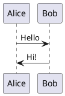
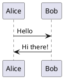
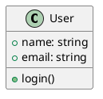

name: "PlantUML Diagram Rendering in Markdown"
created: "2025-10-16"
confidence_score: 8.5/10

---

## Goal
Implement PlantUML diagram rendering support in markdown blog posts, allowing authors to write PlantUML code blocks that are automatically converted to SVG diagrams during markdown processing.

## Why
- **Enhanced Documentation**: Enable visual communication through diagrams (UML, sequence, architecture, etc.)
- **Better Content Quality**: Technical posts benefit from visual representations
- **Seamless Integration**: Authors can write diagrams directly in markdown without external tools
- **Dynamic Rendering**: Diagrams are generated on-demand via PlantUML server, no local setup needed

## What
Transform markdown code blocks with `plantuml` language tag into rendered SVG images using PlantUML's public server.

### Example Usage
Authors will write in markdown:
````markdown

````

This will render as:
```html

```

### Success Criteria
- [x] PlantUML code blocks are detected and processed
- [x] Diagrams render as SVG images via PlantUML server
- [x] Images are responsive (max-width: 100%)
- [x] Regular code blocks remain unaffected
- [x] Error handling for invalid PlantUML syntax
- [x] Works with existing markdown pipeline (remark)
- [x] TypeScript type safety maintained

---

## All Needed Context

### Documentation & References

```yaml
# MUST READ - Include these in your context window

- url: https://www.npmjs.com/package/plantuml-encoder
  why: Core library for encoding PlantUML code to URL-safe strings
  section: Basic usage with encode() function
  critical: Works in Node.js, no dependencies needed

- url: https://github.com/markushedvall/plantuml-encoder
  why: Examples of encode/decode usage
  section: README examples

- url: https://www.plantuml.com/plantuml/
  why: Official PlantUML server for rendering diagrams
  section: URL format - /plantuml/svg/[encoded] for SVG output
  critical: Use SVG format for better quality and scalability

- url: https://github.com/remarkjs/remark/blob/main/doc/plugins.md
  why: Official remark plugin development guide
  section: Plugin structure, transformer function pattern
  critical: Plugins return transformer that receives (tree, file)

- url: https://www.npmjs.com/package/@akebifiky/remark-simple-plantuml
  why: Reference implementation of PlantUML remark plugin
  section: Usage and configuration options
  note: Package is 4 years old but provides good pattern reference

- file: lib/markdown.ts
  why: Current markdown processing implementation using remark
  section: Lines 48-72 - parseMarkdown function and remark pipeline
  critical: Already uses remark().use(html).process() pattern

- file: lib/posts.ts
  why: How markdown is consumed in the application
  section: Lines 38-43 - parseMarkdown usage and content flow

- file: types/post.ts
  why: TypeScript interfaces for post data
  section: PostFrontmatter and Post interfaces

- file: CLAUDE.md
  why: Project coding standards and conventions
  section: TypeScript規範, 命名規範, 程式碼組織原則
  critical: Follow BEM for CSS, camelCase for functions, PascalCase for types
```

### Current Codebase Structure

```bash
kimi-kiki-blog/
├── lib/
│   ├── markdown.ts         # Current: gray-matter + remark + remark-html
│   ├── posts.ts            # Uses parseMarkdown to process posts
│   └── utils.ts            # Utility functions
├── types/
│   └── post.ts             # Post and PostFrontmatter interfaces
├── content/
│   └── posts/
│       ├── hello-world.md
│       └── claude-make-blog.md
├── app/
│   └── posts/[slug]/page.tsx  # Post rendering page
├── components/
│   └── markdown/              # Markdown-related components (if any)
└── package.json              # Dependencies: remark@15.0.1, remark-html@16.0.1
```

### Desired Codebase Structure (After Implementation)

```bash
kimi-kiki-blog/
├── lib/
│   ├── markdown.ts         # MODIFIED: Add plantuml plugin to remark pipeline
│   ├── remark-plantuml.ts  # NEW: Custom remark plugin for PlantUML
│   ├── posts.ts            # UNCHANGED
│   └── utils.ts            # UNCHANGED
├── types/
│   └── post.ts             # UNCHANGED
└── package.json            # ADD: plantuml-encoder dependency
```

### Known Gotchas & Library Quirks

```typescript
// CRITICAL: Remark plugins follow unified ecosystem patterns
// - Plugin is a function that returns a transformer
// - Transformer receives (tree, file) and modifies AST in-place
// - Must use visitor pattern to traverse nodes safely

// GOTCHA: remark-html is already in pipeline
// - Our plugin must run BEFORE remark-html converts to HTML
// - Plugin order matters: .use(remarkPlantUML).use(html)

// CRITICAL: Code blocks in remark AST
// - Type: 'code'
// - Properties: { lang: 'plantuml', value: '...', meta: null }
// - Need to transform to 'html' node type for remark-html to preserve

// GOTCHA: PlantUML encoder
// - encode() returns string, not Buffer
// - Already URL-safe, can be used directly in URLs
// - Handles @startuml/@enduml tags automatically

// PROJECT CONVENTION: TypeScript strict mode
// - No 'any' types allowed (see CLAUDE.md)
// - Use explicit types for AST nodes
// - Add JSDoc comments with @param and @returns

// PROJECT CONVENTION: Error handling
// - Always try-catch in async functions
// - Log errors with console.error
// - Provide fallback behavior (render original code block)

// RESPONSIVE: Images must be responsive
// - Add inline style: max-width:100%
// - Matches project's responsive design principles
```

---

## Implementation Blueprint

### Data Models and Structure

```typescript
// lib/remark-plantuml.ts
// Types for remark AST nodes we'll work with

import type { Root, Code, Html } from 'mdast'
import type { Plugin } from 'unified'

// Code node from mdast (input)
interface CodeNode extends Code {
  type: 'code'
  lang: string | null
  value: string
  meta?: string | null
}

// Html node for mdast (output)
interface HtmlNode extends Html {
  type: 'html'
  value: string
}
```

### Task Breakdown (In Order)

```yaml
Task 1: Install Dependencies
ACTION: Add plantuml-encoder package
COMMAND: npm install plantuml-encoder
VALIDATION: Check package.json dependencies section

Task 2: Create Custom Remark Plugin
CREATE: lib/remark-plantuml.ts
PATTERN: Follow unified plugin structure (function returning transformer)
RESPONSIBILITY:
  - Export default plugin function
  - Accept optional config (baseUrl)
  - Return transformer that visits code nodes
  - Transform plantuml code blocks to HTML img tags
  - Preserve non-plantuml code blocks unchanged

Task 3: Integrate Plugin into Markdown Pipeline
MODIFY: lib/markdown.ts
FIND: Line 54-56 where remark().use(html).process() is called
INJECT: Add .use(remarkPlantUML) before .use(html)
PRESERVE: Existing imports, parseMarkdown signature, error handling
PATTERN: Follows existing plugin chaining pattern

Task 4: Manual Integration Test
CREATE: content/posts/test-plantuml.md (temporary test file)
CONTENT: Add frontmatter + plantuml code block example
ACTION: Run dev server and verify diagram renders
VALIDATION: Visual check in browser

Task 5: Cleanup
DELETE: content/posts/test-plantuml.md (or keep as example)
VERIFY: No console errors, existing posts still render correctly
```

### Task 1: Install Dependencies

```bash
# Simple npm install
npm install plantuml-encoder

# Expected: plantuml-encoder added to package.json dependencies
# Version: Should install latest stable (currently 1.4.0)
```

### Task 2: Create Custom Remark Plugin (Pseudocode)

```typescript
// lib/remark-plantuml.ts

/**
 * Remark plugin to transform PlantUML code blocks into rendered SVG images
 *
 * PATTERN: Unified plugin architecture
 * - Export function that returns transformer
 * - Use visit() to traverse AST nodes
 * - Modify nodes in-place
 *
 * @param options - Plugin configuration
 * @param options.baseUrl - PlantUML server URL (default: plantuml.com SVG endpoint)
 * @returns Transformer function
 */

import { visit } from 'unist-util-visit'
import type { Plugin } from 'unified'
import type { Root, Code } from 'mdast'
import plantumlEncoder from 'plantuml-encoder'

interface PluginOptions {
  baseUrl?: string  // Default: 'https://www.plantuml.com/plantuml/svg'
}

const remarkPlantUML: Plugin<[PluginOptions?], Root> = (options = {}) => {
  // REASON: Provide sensible default for PlantUML server
  const baseUrl = options.baseUrl || 'https://www.plantuml.com/plantuml/svg'

  return (tree) => {
    // PATTERN: Visit all 'code' nodes in the AST
    visit(tree, 'code', (node: Code, index, parent) => {
      // REASON: Only process code blocks with lang='plantuml'
      if (node.lang !== 'plantuml') {
        return  // Skip non-plantuml blocks
      }

      try {
        // CRITICAL: Encode PlantUML source to URL-safe string
        const encoded = plantumlEncoder.encode(node.value)

        // REASON: Construct full image URL
        const imageUrl = `${baseUrl}/${encoded}`

        // REASON: Generate responsive HTML img tag
        // - alt text for accessibility
        // - max-width:100% for responsive design (matches CLAUDE.md guidelines)
        // - loading=lazy for performance
        const htmlValue = ``

        // CRITICAL: Transform node type from 'code' to 'html'
        // REASON: remark-html will preserve 'html' nodes as-is
        Object.assign(node, {
          type: 'html',
          value: htmlValue,
        })
      } catch (error) {
        // GOTCHA: If encoding fails, log error but don't crash
        // FALLBACK: Leave original code block unchanged
        console.error('Failed to encode PlantUML diagram:', error)
        // Node remains as 'code' type, will be rendered as code block
      }
    })
  }
}

export default remarkPlantUML
```

### Task 3: Integrate Plugin (Pseudocode)

```typescript
// lib/markdown.ts

// ADD IMPORT at top (around line 14)
import remarkPlantUML from './remark-plantuml'

// MODIFY parseMarkdown function (lines 48-72)
export async function parseMarkdown(content: string): Promise<ParsedMarkdown> {
  try {
    const { data, content: markdownContent } = matter(content)

    // CRITICAL: Plugin order matters!
    // remarkPlantUML MUST come before html plugin
    // REASON: remarkPlantUML transforms code->html nodes
    //         remark-html then preserves html nodes
    const processedContent = await remark()
      .use(remarkPlantUML)  // ADD THIS LINE - transforms plantuml blocks
      .use(html)            // EXISTING - converts markdown to HTML
      .process(markdownContent)

    let htmlContent = processedContent.toString()

    // EXISTING: Add IDs to headings
    htmlContent = addHeadingIds(htmlContent)

    return {
      frontmatter: data as PostFrontmatter,
      content: markdownContent,
      html: htmlContent,
    }
  } catch (error) {
    // EXISTING: Error handling unchanged
    console.error('Error parsing markdown:', error)
    throw new Error('Failed to parse markdown content')
  }
}
```

### Integration Points

```yaml
DEPENDENCIES:
  - add to: package.json
    package: plantuml-encoder
    version: ^1.4.0
    why: Encode PlantUML code to URL-safe strings

NPM_INSTALL:
  - command: npm install plantuml-encoder
    location: project root

FILES_TO_CREATE:
  - path: lib/remark-plantuml.ts
    type: Custom remark plugin
    exports: default plugin function

FILES_TO_MODIFY:
  - path: lib/markdown.ts
    changes:
      - Add import for remarkPlantUML
      - Add .use(remarkPlantUML) to remark pipeline
      - Maintain existing error handling

EXTERNAL_SERVICES:
  - service: PlantUML Server (www.plantuml.com)
    endpoint: https://www.plantuml.com/plantuml/svg/{encoded}
    why: Renders PlantUML code to SVG images
    fallback: Could use self-hosted server by changing baseUrl
```

---

## Validation Loop

### Level 1: Syntax & Style

```bash
# REASON: Ensure TypeScript types are correct
npx tsc --noEmit

# Expected: No type errors
# Common errors:
#   - Missing type imports from 'mdast' or 'unified'
#   - Incorrect node type transformations
# Fix: Add proper imports and type assertions

# REASON: Ensure code follows project linting rules
npm run lint

# Expected: No linting errors
# If errors: Follow Next.js ESLint rules, auto-fix where possible
```

### Level 2: Manual Integration Test

```bash
# STEP 1: Start dev server
npm run dev

# Expected: Server starts on http://localhost:3000
# If error: Check console for build errors, fix and restart
```

```markdown
# STEP 2: Create test post
# CREATE: content/posts/test-plantuml.md

---
title: PlantUML Test
excerpt: Testing PlantUML diagram rendering
date: 2025-10-16
tags:
  - Test
author:
  name: kimi-kiki
---

# PlantUML Diagram Test

## Simple Sequence Diagram



## Class Diagram



## Regular Code Block (Should NOT Transform)

```javascript
console.log('This is regular code')
```
````

```bash
# STEP 3: Navigate to test post
# URL: http://localhost:3000/posts/test-plantuml

# VALIDATION CHECKS:
# ✓ Page loads without errors
# ✓ PlantUML diagrams render as images (not code blocks)
# ✓ Images are visible and display correct diagrams
# ✓ Images are responsive (resize browser to test)
# ✓ Regular code blocks still render as code (not transformed)
# ✓ No console errors in browser DevTools

# If diagram doesn't render:
#   1. Check Network tab for failed image requests
#   2. Copy image URL and test in browser directly
#   3. Verify PlantUML syntax is valid
#   4. Check console for encoding errors
```

### Level 3: Cross-Browser Verification

```bash
# Test in multiple browsers to ensure compatibility
# - Chrome/Edge (Chromium)
# - Firefox
# - Safari (if on macOS)

# VALIDATION:
# ✓ Diagrams render in all browsers
# ✓ Images are responsive in all browsers
# ✓ No CORS errors (using public PlantUML server)
```

### Level 4: Error Handling Test

```markdown
# CREATE: Test post with invalid PlantUML
# Add to content/posts/test-plantuml.md

## Invalid PlantUML (Should Fallback to Code Block)

```plantuml
This is not valid PlantUML syntax!
No @startuml or @enduml tags
```
````

```bash
# VALIDATION:
# ✓ Page still loads without crashing
# ✓ Invalid PlantUML falls back to code block rendering
# ✓ Console shows error log (expected behavior)
# ✓ Other valid diagrams on same page still render
```

---

## Final Validation Checklist

Before marking this task complete, verify:

- [ ] TypeScript compiles without errors: `npx tsc --noEmit`
- [ ] Linting passes: `npm run lint`
- [ ] Dev server starts without errors: `npm run dev`
- [ ] PlantUML diagrams render as SVG images in browser
- [ ] Images are responsive (max-width: 100%)
- [ ] Regular code blocks unaffected (still render as code)
- [ ] Invalid PlantUML gracefully falls back to code block
- [ ] Console shows no errors (except expected encoding errors for invalid syntax)
- [ ] Existing posts still render correctly (regression check)
- [ ] Build succeeds: `npm run build`
- [ ] Production build works: `npm start` after build

---

## Anti-Patterns to Avoid

❌ **Don't modify remark-html internals** - Work with the plugin API
❌ **Don't skip error handling** - Invalid PlantUML should not crash the page
❌ **Don't use PNG format** - SVG is better for quality and scalability
❌ **Don't forget responsive styling** - Images must adapt to screen size
❌ **Don't use 'any' types** - Follow project's TypeScript strict mode (CLAUDE.md)
❌ **Don't modify existing markdown files** - Only add new test file, then remove it
❌ **Don't hardcode PlantUML server URL** - Make it configurable via options
❌ **Don't forget to visit only 'code' nodes** - Visiting all nodes would be inefficient
❌ **Don't mutate node properties directly** - Use Object.assign for type transformation

---

## Success Indicators

✅ Author writes PlantUML in markdown → renders as diagram
✅ Regular code blocks unchanged → still show as code
✅ Invalid PlantUML handled gracefully → falls back to code block
✅ Images are responsive → work on mobile and desktop
✅ No new dependencies besides plantuml-encoder → minimal impact
✅ TypeScript types correct → no type errors
✅ Follows project conventions → matches CLAUDE.md guidelines

---

## Future Enhancements (Out of Scope)

These are NOT part of this PRP but could be added later:

- Dark mode support (detect theme and switch PlantUML color scheme)
- Cache encoded diagrams (avoid re-encoding on every build)
- Self-hosted PlantUML server (remove dependency on public server)
- Diagram zoom functionality (click to enlarge)
- Export diagram source (button to view/copy PlantUML code)
- Syntax validation before encoding (show helpful error messages)

---

## References

- [PlantUML Official](https://plantuml.com/)
- [plantuml-encoder npm](https://www.npmjs.com/package/plantuml-encoder)
- [Remark Plugin Guide](https://github.com/remarkjs/remark/blob/main/doc/plugins.md)
- [unist-util-visit](https://github.com/syntax-tree/unist-util-visit)
- [mdast (Markdown AST)](https://github.com/syntax-tree/mdast)

---

**Estimated Implementation Time**: 1-2 hours
**Complexity**: Medium (requires understanding unified/remark ecosystem)
**Risk Level**: Low (isolated change, graceful fallback)
