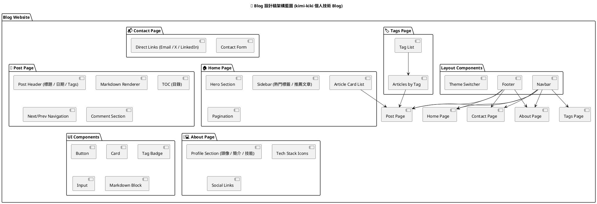

>自從 2022 年 ChatGPT 橫空出世以來，人工智慧的發展可謂日新月異。如今，AI 不僅能生成文字、作曲、畫圖，甚至能撰寫程式碼，讓整個軟體開發世界發生了翻天覆地的改變。
面對這股浪潮，許多工程師開始憂慮：我們會被 AI 取代嗎？程式開發的主導權，是否正逐漸被 AI 奪走？
然而，與其恐懼，不如學會與 AI 共創。如何與 AI 高效協同開發，快速構建出既具擴展性又易於維護的系統架構，正成為新時代工程師的核心競爭力。

## 一、前言
為了學會怎麼和 AI 一起高效開發，我決定動手做一個實驗專案 —— 「技術部落格」。
在這個過程中，我與 AI 討論構想、發想網站架構，並透過多輪對話生成設計稿、需求文件與執行計畫。從最初的概念發想，到最後完成部署的完整開發旅程。


## 二、規劃階段：與 AI 討論 Blog 架構
### 1. 告知AI目前想要實作怎樣的專案
**詢問:** 我想建立一個個人blog ，可以用markdow方式發表文章，有什麼建議
**AI:** (以下為重點簡略列出...)
1. 推薦技術組合:Next.js 14 + Contentlayer + MDX + Tailwind
2. 架構範例

```cmd=
my-blog/
├── content/
│   ├── posts/
│   │   ├── first-post.md
│   │   └── nextjs-tips.md
├── app/
│   ├── page.tsx          # 首頁（文章列表）
│   ├── posts/
│   │   └── [slug]/page.tsx   # 文章頁面
├── contentlayer.config.ts
├── next.config.mjs
├── tailwind.config.js
└── package.json

```
3. Markdown 文章格式範例
```markdown
---
title: "我用 Next.js 打造個人部落格的心得"
date: "2025-10-13"
tags: ["Next.js", "Blog", "前端工程"]
summary: "這篇文章分享如何用 Next.js 14 + Contentlayer 快速建立 Markdown 部落格"
---

## 🎯 目標

打造一個快速又可維護的技術部落格。


```
4. Contentlayer 設定簡介
```javascript=
import { defineDocumentType, makeSource } from "contentlayer/source-files";

export const Post = defineDocumentType(() => ({
  name: "Post",
  filePathPattern: `posts/*.md`,
  fields: {
    title: { type: "string", required: true },
    date: { type: "date", required: true },
    summary: { type: "string" },
    tags: { type: "list", of: { type: "string" } },
  },
  computedFields: {
    url: { type: "string", resolve: (post) => `/posts/${post._raw.flattenedPath}` },
  },
}));

export default makeSource({
  contentDirPath: "content",
  documentTypes: [Post],
});

```
### 2. 詢問設計稿要考慮的問題
**詢問:** 如果要有設計稿 ，需要考慮怎樣的問題
**AI:** (以下為重點簡略列出...)
- 定位與目的
- 資訊架構
- UI/UX 設計考量
- Markdown 功能需求
- 延伸設計考量

### 3. 設計稿架構藍圖
**詢問:** 劃出設計稿架構藍圖以plantuml方式
**AI:** (以下為重點簡略列出...)



## 三、設計階段 : AI 協作完成設計稿
將AI 討論的結果，和預期想達到的網站要呈現的樣子整理成文件。在blog的網站規劃中，並未採用AI 推薦技術組合，而是採用Next.js + Markdown + UI 組件+ SCSS 為核心的技術架構. 將整理後的需求，請ai 用純 HTML + JavaScript 的建立設計稿原型


```markdown
# blog 需求規劃
目的:紀錄學習及技術分享，目的是同行工程師、一般大眾，語言風格中文為主
## 一、架構藍圖
my-blog/
├── app/
│   ├── layout.tsx      # 共用 Layout：Navbar、Footer、主題切換
│   ├── page.tsx        # 首頁：文章列表
│   ├── tags/
│   │   └── [tag]/page.tsx   # 標籤頁
│   ├── posts/
│   │   └── [slug]/page.tsx  # 單篇文章頁
│   ├── about/page.tsx
│   └── contact/page.tsx
├── components/
│   ├── Navbar.tsx
│   ├── Footer.tsx
│   ├── ArticleCard.tsx
│   ├── TagBadge.tsx
│   ├── ThemeSwitcher.tsx
│   └── MarkdownRenderer.tsx
├── content/
│   └── posts/*.md
├── lib/
│   ├── markdown.ts     # Markdown 解析設定
│   └── utils.ts
└── scss/
    ├── components                   # components scss file
    │     ├── DatePicker.scss
    │     ├── InputBox.scss
    │     └── Popup.scss
    ├──core                          # 共用的 scss file
    |    ├── Theme
    |    └── Global.scss             # design-tokens
    └── styles.scss                  # SCSS main file
├── public/
│   └── images/
├── next.config.js
├── tsconfig.json
└── package.json

## 二、資訊架構

設計前要先規劃好資訊層次與導覽結構：
| 區塊        | 功能           | 範例                          |
| --------- | ------------ | --------------------------- |
| 🏠 首頁     | 展示最新/精選文章    | Banner、文章卡片、標籤              |
| 📚 文章頁    | 顯示單篇內容       | Markdown 轉 HTML + TOC（目錄）   |
| 🧩 分類/標籤頁 | 按主題篩選文章      | #React #AI #筆記              |
| 👩‍💻 關於我 | 個人介紹、社群連結    | GitHub / YouTube / LinkedIn |
| 📬 聯絡我    | 表單或 Email 連結 | 用於聯絡合作或讀者留言                 |
## 三、設計風格
1. Layout 風格:
    * 雙欄（側邊欄含分類/推薦文章） 可收合
    * 最大寬度約 800px～900px，保證可讀性
    * 頁首固定導覽列（Navbar）
2. 視覺風格:
    * 選色主題：亮色系（淺灰＋主色）或暗色系（黑底＋亮文字）
    * 字體選擇：標題用無襯線、內文用襯線體會更穩定
    * Logo 與配色一致性（可之後延伸成個人品牌）

響應式設計（Responsive）:
手機版導覽改為 Drawer 或浮動按鈕
確保 Markdown 轉出的圖片與表格在小螢幕也不爆版
以 Markdown 發表文章 | 功能 | 設計影響 |
| ---------------- | ---------------------- | 
| 標題層級（#、##、###） | 自動生成目錄（TOC） | 
| 程式碼區塊（js ...） | Syntax Highlight、深色底 |
| 引用、分隔線、連結 | 不同排版樣式 | 
| 圖片 | 需設計適合寬度與懸浮效果 |
| Tags frontmatter | 要有地方展示標籤（chips/badges） |

其他
- 文章卡片元件設計（title、excerpt、date、tags）
- 目錄 TOC（側邊浮動 or 文章頂端）
- 深色/淺色模式切換
- 留言系統區塊（預留空間給 Giscus / Disqus）
- SEO 元素（標題層級清晰、meta 預留）

```

## 四、開發階段
根據Claude Code 最佳實踐原則 及使用上下文工程模板 Context Engineering 方式進行開發。

### step1: 建立專案目錄

### step2: 下載context-engineering-intro 模板
下載context-engineering-intro 模板，將.claude , PRPs, examples 資料夾放到專案目錄下
```cmd=
context-engineering-intro/
├── .claude/
│   ├── commands/
│   │   ├── generate-prp.md    # 用來生成完整的 PRP 
│   │   └── execute-prp.md     # 執行 PRPs 建構功能
│   └── settings.local.json    # Claude Code 權限設定
├── PRPs/
│   ├── templates/
│   │   └── prp_base.md       # Base template for PRPs
│   └── EXAMPLE_multi_agent_prp.md  # Example of a complete PRP
├── examples/                  # Your code examples (critical!)
├── CLAUDE.md                 # Global rules for AI assistant
├── INITIAL.md               # Template for feature requests
├── INITIAL_EXAMPLE.md       # Example feature request
└── README.md                # This file

```

### step3: 產生claude.md
在確立需求文件與設計稿後，我將這些資料交給 Claude，請他根據具體需求與設計概念生成一份 [claude.md](https://raw.githubusercontent.com/katy-tsai/kimi-kiki-blog/refs/heads/main/README.md) 專案文件。


### step4: 在INITIAL.md下 寫下初始化專案的指令
由於初始化專案需求，專案架構和功能皆寫在claude.md
所以在INITIAL.md，只簡單寫下
```
## FEATURE:

技術部落格平台初使化，用於紀錄學習及技術分享。

## DOCUMENTATION:
請根據CLAUDE.md 建立blog 專案
```

### step5:執行 /generate-prp INITIAL.md 

 /generate-prp 的命令是用 來產生context-engineering 中的PRP (PRP 的設計就像是一份「AI 的使用手冊」或「工作合約」) , 告訴 ai 為何存在、應該怎麼行動、要如何執行. 
```
/generate-prp INITIAL.md 
```
- 執行結束，在 PRPs 資料夾會產生 [blog-initialization.md](https://raw.githubusercontent.com/katy-tsai/kimi-kiki-blog/refs/heads/main/PRPs/blog-initialization.md)
- 檢查產生的PRP是否符合需求，是否需調整


### step5: 執行 /execute-prp blog-initialization.md
- 執行上一步所產生的prp ，AI開始實作, 完成專案建置
- 完成網站後，查看執行結果是否符合預期。

## 五、Debug 和改進調整
AI 寫的程式不會一次完美。 和真實的開發過程一樣，需經過不斷的調整與改進，在debug方面，如果是一般簡單的問題，可以直接調整，直接截圖描述錯誤，直接請ai改，會比寫md檔描述訊息，請ai出執行步驟，再來處理，解決問題的成功率更高. (因為ai會複雜化問題xd)
若問題複雜，則先理出思路，再開需求spec , 依需求spec產生prps, 在執行prps的步驟處理，

## 六、部署
根據AI推薦最快的部署方式
### 連結 GitHub 自動部署
- step1: blog push 到 GitHub 
- step2: 登入 https://vercel.com   
- step3: 點選 repo → Vercel 自動偵測 Next.js → 點「Deploy」 
- step4:約 1 分鐘後完成，會得到一個網址。  

