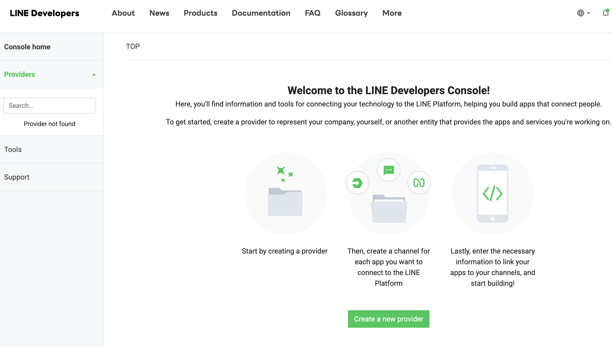
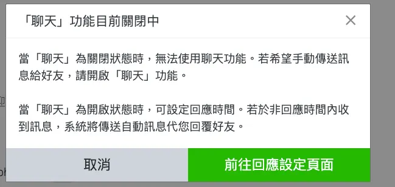
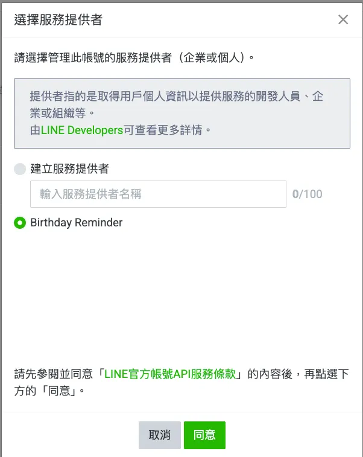
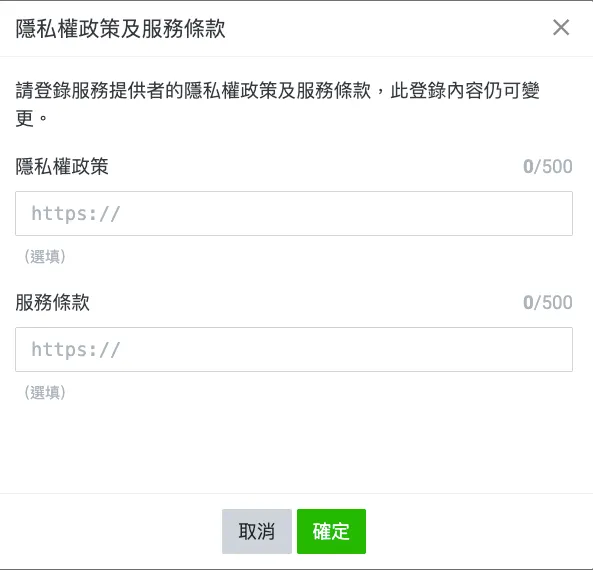
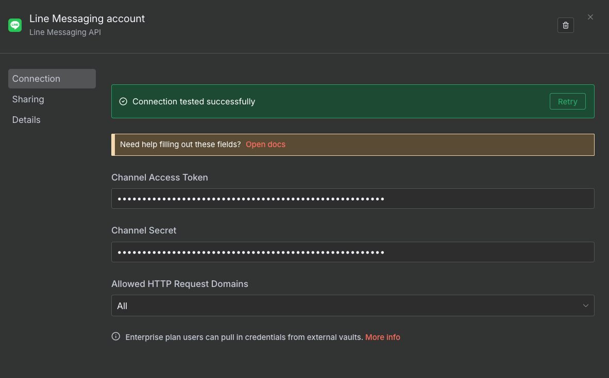

> 使用n8n , 或是串接line Messaging API 皆需要有CHANNEL_ACCESS_TOKEN 以下是完整的申請步驟
## Step1 : 建立 LINE Developers 帳號
1. 打開 LINE Developers Console [https://developers.line.biz/console/](https://developers.line.biz/console/) ,使用你的 LINE 帳號登入。
2. 登入後建立line 商家。
3. 建立開發者帳號

## Step2: 建立 Provider
帳號建立完成後，Create a new Provider, 會看到「Provider（提供者）」的概念。Provider 可以是：
你的個人名稱或你的專案名稱

## Step3:建立 Messaging API Channel
1. 在剛建立的 Provider 底下，點「Create a Messaging API channel」

2. 資料通道必須藉由 LINE 官方帳號建立, 請按 Create a LINE Official Account 繼續：

3. 登入建立官方帳號的頁面, 請按 **登入**：
    →首次登入需要進行簡訊認證, 請按**進行簡訊認證**
    → 接著就可以建立Line官方帳號

4. 完成Line  官方帳號的建立後，點選聊天的頁籤 →前往回應設定頁面
   
   

5. 在回應設定中，點擊開啟Messaging API的設定畫面
   

6. 啟用Messageing API
   

7. 選擇服務提供商
 

8. 隱私權政策及服務條款 →直接按同意
   

9. 啟用Messaging API
    

10. 取得 channel 資訊
    

## Step4: 產生 Channel access token
1. 返回Developer console [https://developers.line.biz/console/](https://developers.line.biz/console/)
   
2. 選擇Messaging Api →取得Channel access token
   

## Step5: 使用 Channel access token
- HTTP Request Node 的設定（範例）：
Method：POST
URL：https://api.line.me/v2/bot/message/push
Headers：Authorization: Bearer {CHANNEL_ACCESS_TOKEN}

- n8n 設定
  填入Channel Access Token，和Channel Secret 即可設定完成

 