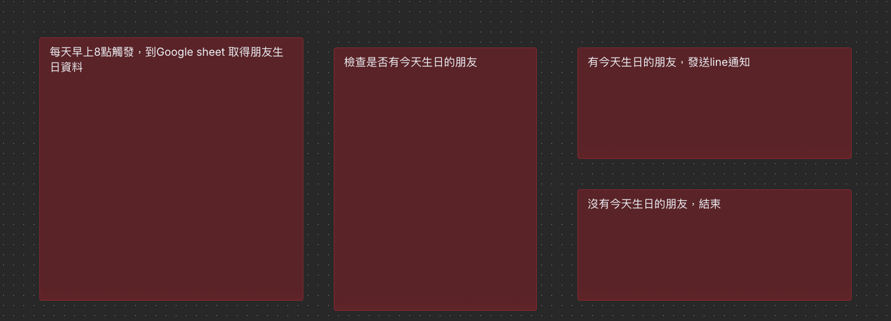

>因為常常忘記朋友的生日，我決定動手做一個「生日提醒助理」。順便練習 n8n 自動化流程，於是我設計了一個系統：把生日資料儲存在 Google Sheet，每天早上 8 點自動檢查是否有人生日，一旦有人生日，就透過 LINE 傳送通知給自己。

## 一、規劃
1. 首先需要有一個n8n 的環境，可以每天早上 8 點自動取得資料檢查是否有朋友生日。

   - 架設n8n 的環境考量，因須每天早上 8 點定時檢查，所以n8n 的環境，不能休眠。 所以選擇以Railway 做為雲端平台。
   - 實作請參考 [新手指南：在 Railway 上快速部署 n8n](https://kimi-kiki-blog.vercel.app/posts/railway_deploy_n8n)
2. 有了 n8n 環境，流程規劃
   

3. 根據流程，需要準備:
   - Google sheet 朋友生日檔案
   - n8n 串接Google sheet 
   - n8n 串接Line 通知
  
## 二、 流程串接 - 串接Google sheet 

>為測式方便，在n8n中選擇Trigger manually 

然後選擇Google Sheets ->Get row(s) in sheet

 
### n8n 串接Google sheet 要先申請和Google sheet 服務的Client ID ，Client Secret來連線
- 點選Credential to connect with，編輯icon

- 取得Client ID ，Client Secret方式:
    #### step1: 登入Google Cloude 選取RPI API 與服務
    

    #### step2: 點選憑証->建立憑証->選擇OAuth用戶端id

    

    #### step3: 應用程式類型選擇網路應用程式，設定名稱為n8n 

    

    #### step4:在已授權的重新導向URI, 填入n8n 設定中OAuth Redirect URL後儲存
    

    #### step5:取得用戶端 ID 和用戶端密碼 ，填入n8n的Client ID ，Client Secret
    

    #### step6: 在目標對像中加入測式使用者
    

    #### step7: 回到PRI API 服務 -> + 啟用API 服務
    
    #### step8: 搜尋Google Sheets Api
    
    #### step9: 啟用Google Sheets Api
    

- 選擇在 Google Cloude加入測式使用者，點選繼續
  

- 選取存取範圍為選擇全部

- 看到Account connected ，即連線完成
 

- 選擇Google sheet 朋友生日檔案 的位置

- 執行，看是否成功取回生日檔案 
> 生日檔案記得放一筆今天生日的測試檔案喔
## 三、流程串接 - 判斷是否有朋友生日
- 新增if 判斷
  
  

## 四、流程串接 - 有朋友生日,LINE Messaging API  設定
1. Install a community node
  - 在 n8n 的主畫面，點擊左下角的「Settings」。
  - 選擇「Community Nodes」。
  - 點擊右上角的「Install a community node」。
  - 在跳出的視窗中，輸入@aotoki/n8n-nodes-line-messaging，打勾後按下「Install」。
  

2. 建立line Messaging ->因為只通知自己所以選擇 Send a message to a user

    
    
    

3. 申請 Line API 金鑰

   - 實作請參考 [新手指南：LINE Messaging API 申請步驟](https://kimi-kiki-blog.vercel.app/posts/line_message_apply)

4. 填入Channel Access Token，Channel Secret ，完成與line messaging api連線

## 五、流程串接 - 取得自己的userId
1. 在n8n 建立一個webhook

2. 將Http Method 設定為Post 

3. 將production Url貼到 Line Developer Console  的Messaging API 下Webhook settings

4. 點擊 n8n 的webhook 按鈕 Listen for test event

> 注意:此時n8n 的workflow不能有任何! , 之前line未設定完成的UserId 可以先隨便輸入，或先刪除line的結點，否則webhook會無法啟動

5. 在Line Developer Console  的Messaging API 下 會有一個官方帳號的qrcode ，掃描後，在對話框輸入hi, 則會有訊息進入webhook
   

6. userId即為line的userId

## 六、流程串接 - 設定Line Messaging
- 設定取的的userId
- 設定事件發生時，發送的line message
- 執行後，確認是否收到測試訊息

## 七、流程串接 - 更改為排程
1. 將一開始為測式方便，在n8n中設定Trigger manually 改為 Schedule Trigger

2. 設定排程為每天早上8點做一次 
   

3. 將生日檔案今天生日的測試檔案改成明天，明天收到line訊息通知就成功囉
 