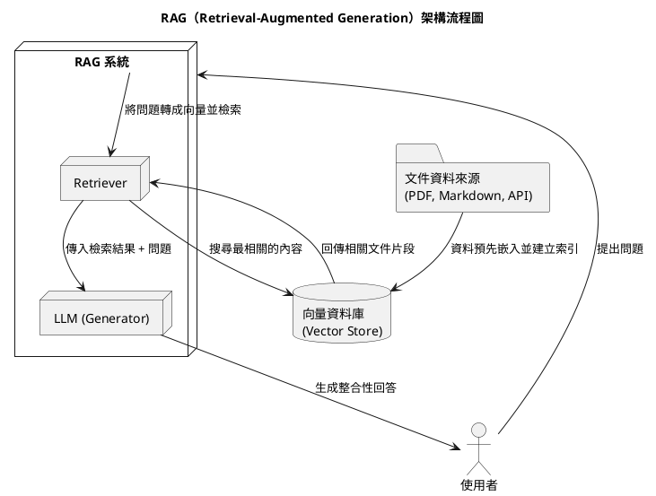

> RAG Agent 的核心概念是「先從知識庫檢索，再生成回答」。
透過讓 AI 在回答前先從外部知識庫搜尋相關內容，
能讓生成的答案更貼近知識提供者想傳遞的正確資訊，
同時大幅降低模型產生幻覺（Hallucination）的風險。
## 一、前言
為了實際練習這項技術，以衛生福利部每日飲食指南手冊 為主要知識來源，實作了一個能回答健康飲食相關問題的 RAG Agent 系統，
讓使用者可以透過自然語言詢問，獲得可靠且符合官方建議的飲食建議。

## 二、RAG 架構概念圖


## 三、環境準備
### 1. python 環境
```cmd
mkdir health_food_agent
cd health_food_agent

uv init -p 3.13
```
### 2.安裝所需套件

```
uv add python-dotenv pypdf langgraph langchain-openai langchain-community langchain-text-splitters langchain-chroma
```

### 3. 專案架構
```
health_food_agent/
├── 📁 .venv/                 (Python虛擬環境)
├── 📁 data/                  (數據文件夾)
        ├── health_food.pdf  (衛生福利部每日飲食指南手冊)     
├── 📁 vectorstore/           (向量存儲)
├── 📄 .env                   (環境變量配置)
├── 📄 .gitignore             (Git忽略文件)
├── 📄 .python-version        (Python版本指定)
├── 🐍 main.py                (主程序入口)
├── 📋 pyproject.toml         (項目配置文件 - uv/Poetry)
└── 📖 README.md              (項目說明文檔)

```
## Step1: import 所需套件
- dotenv 環境相關參數設定引用
  ```python
    from dotenv import load_dotenv
    load_dotenv()
  ```
  > 不論使用何種生成式模型(LLM), 都需要提供 api_key , 最好不要直接寫在程式中，需要要一個.env的檔案來存放，而在程式中從dotenv 套件中引用load_dotenv ，來讓程式自動取得api_key
  
- pdf 資料預先嵌入並建立索引

    ```python
    ## os 用來判斷檔案路徑是否存在
    import os
    ## PyPDFLoader 讀取pdf內容
    from langchain_community.document_loaders import PyPDFLoader
    ## RecursiveCharacterTextSplitter 將pdf 內容分成chucks
    from langchain_text_splitters import RecursiveCharacterTextSplitter
    ##  OpenAIEmbeddings 將分割成chcks的資料轉成向量
    from langchain_openai import  OpenAIEmbeddings
    ## Chroma 向量資料庫
    from langchain_chroma import Chroma
    ```

- langchain 相關
    ```python
    ## llm對話模型
    from langchain_openai import ChatOpenAI
    ## 對話模型訊息種類
    from langchain_core.messages import BaseMessage,SystemMessage,ToolMessage,HumanMessage
    ## 註明llm對話模型可使用工具
    from langchain_core.tools import tool
    ```
- langGraph 相關
    ```python
    ## langgraph 畫出stateGraph , 可以儲存流程的state
    from langgraph.graph import StateGraph,START,END
    ## typing 用來規範存儲state的類型
    from typing import TypedDict,Sequence,Annotated
    ## Annotated 中用add_messages來增加type的metadata
    from langgraph.graph.message import add_messages
    ```

## Step 2 文件資料前處理
- 讀取pdf內容 (將資料放到data資料夾下)，用PyPDFLoader 取得pdf資料
  ```python
    pdf_path="./data/health_food.pdf"
    ## load documents 
    if not os.path.exists(pdf_path):
        raise FileNotFoundError(f"PDF file not found: {pdf_path}")
    pdf_loader = PyPDFLoader(pdf_path)
    ## check pdf
    try:
        pages = pdf_loader.load()
        print(f"PDF loaded successfully with {len(pages)} pages.")

    except Exception as e:
        print(f"Error loading PDF: {e}")
        raise 
  ```

- 用RecursiveCharacterTextSplitter 拆分chuck 文本分段）
    ```python
    ## split documents
    text_splitter = RecursiveCharacterTextSplitter(
        chunk_size=1000, ## 每個 chunk 大小為 1000 字元
        chunk_overlap=200 ## 重疊部分為 200 字元
    )
    pages_split = text_splitter.split_documents(pages)
    print(f"Total chunks created: {len(pages_split)}")
    ```

## Step3 建立向量資料庫
- 使用 Embedding 模型轉換文本 → 向量
  ```python
    ## create vector store
    embeddings=OpenAIEmbeddings(model="text-embedding-3-small")

    persist_directory = "./vectorstore"
    collection_name = "health_food_collection"
    if not os.path.exists(persist_directory):
        os.makedirs(persist_directory)  
    try:
        vector_store = Chroma.from_documents(
            documents=pages_split,
            embedding=embeddings,
            persist_directory=persist_directory,
            collection_name=collection_name
        )
    except Exception as e:
        print(f"Error creating vector store: {e}")
        raise
  ```

## Step4: 定義查詢工具
  - 定義如何從vector store 查詢的工具
   ```python
    ## 定義工具
    retriever = vector_store.as_retriever(
        search_type="similarity", 
        search_kwargs={"k": 3} ## 返回最相似的 5 個文件
        )  
    @tool
    def retriever_tool(query: str) -> str:
        """Retrieve relevant documents based on the query."""
        docs = retriever.invoke(query)
        if not docs:
            return "No relevant documents found."
        results=[]
        for i, doc in enumerate(docs):
            print(f"Document {i+1}:\n{doc.page_content}")
            results.append(f"Document {i+1}:\n{doc.page_content}")
            
        return "\n\n".join(results)

    tools = [retriever_tool]
    llm=ChatOpenAI(
            model_name="gpt-4",
            temperature=0 ## 設定為 0 以獲得更準確的回答
        )
    llm=llm.bind_tools(tools)

    tools_dict={tool.name:tool for tool in tools}

   ```
 > llm 設定前，要記得在.env 文件裡設定 apy Key
 ```cmd
 OPENAI_API_KEY=sk-xxxxx.............
 ```
## step5: 請Ai 根據pdf 產出ai agent retriever 的 systeom prompt
- 下面我是用衛生福利部每日飲食指南手冊 請claude 以精簡的方式 產出ai agent 的 systeom prompt 
```python
    system_prompt="""
    You are a nutrition assistant based on Taiwan’s Daily Dietary Guidelines.
    Answer in Traditional Chinese, citing handbook data.
    Tasks:
    Explain six food groups and daily portions
    Give serving conversions and nutrient info
    Use retrieval for exact data or examples

    Rules:
    Be specific with units (g, bowl, serving)
    Use common Taiwanese foods
    Suggest professional help for special diets
    Promote balanced six-group intake
    """
```
## step6: 建立LangGraph 的stateGraph


```python
    ## 1. 定義 State
    class AgentState(TypedDict):
        messages: Annotated[Sequence[BaseMessage],add_messages]

    ## 2. 定義node -llm action
    def call_llm(state: AgentState) -> AgentState:
        messages=list(state["messages"])
        messages=[SystemMessage(content=system_prompt)]+messages
        message=llm.invoke(messages)
        return {"messages":[message]}

    ## 3. 定義node -retriver_agent action
    def retriver_action(state:AgentState)->AgentState:
        tool_calls=state["messages"][-1].tool_calls
        results=[]
        for t in tool_calls:
            print(f"calling toll:{t['name']} with query:{t['args'].get('query','No query provided')}")
            
            if not t['name'] in tools_dict:
                result="Incorrect tool name,please Retry and select tool from available tools."
            else:
                result=tools_dict[t['name']].invoke(t['args'].get('query',''))
            results.append(ToolMessage(tool_call_id=t['id'],tool_name=t['name'],content=str(result)))
        return {"messages":results}

    ## 4.判斷是否繼續查詢的ation
    def should_continue(state: AgentState) -> bool:
        last_message=state["messages"][-1]
        return hasattr(last_message, "tool_calls") and len(last_message.tool_calls)>0
    
    ## 5.定義node 和edges
    rag_graph = StateGraph(AgentState)
    rag_graph.add_node("llm", call_llm)
    rag_graph.add_node("retriver_angent", retriver_action)
    rag_graph.add_edge(START, "llm")
    rag_graph.add_conditional_edges("llm", should_continue, {True: "retriver_angent", False: END})
    rag_graph.add_edge("retriver_angent", "llm")
    rag_app=rag_graph.compile()
```

## step7: 執行 function
```python
def running_agent():
    print("\n========= RAG Agent =========")
    while True:
        user_input= input("What is your Question (or 'exit' to quit): ")
        if user_input.lower() in ['exit', 'quit']:
            break
        messages = [HumanMessage(content=user_input)]
        result = rag_app.invoke({"messages":messages})
        print('\n========= Agent Answer =========')
        print(result['messages'][-1].content)

if __name__ == "__main__":
    running_agent()

```
- 執行 uv run main.py , 就可以開始問問題了
  
