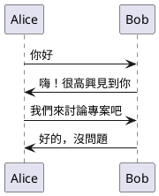
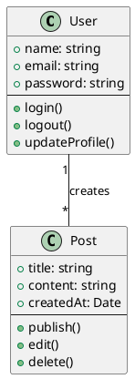
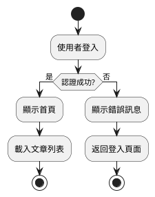
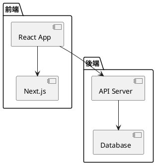
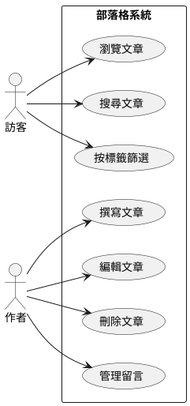
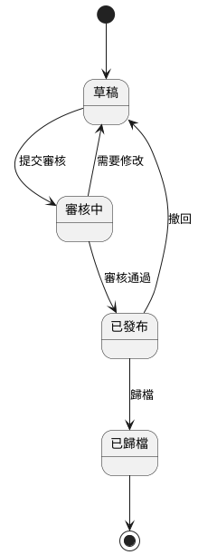
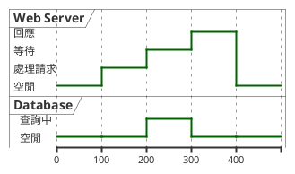

# PlantUML 圖表渲染測試

這篇文章用來測試 PlantUML 圖表在部落格中的渲染功能。

## 測試 1: 簡單序列圖 (Sequence Diagram)

以下是一個簡單的序列圖範例：



## 測試 2: 類別圖 (Class Diagram)

展示物件導向設計的類別結構：



## 測試 3: 活動圖 (Activity Diagram)

展示工作流程：



## 測試 4: 元件圖 (Component Diagram)

展示系統架構：



## 測試 5: 用例圖 (Use Case Diagram)

展示系統功能和使用者互動：



## 測試 6: 狀態圖 (State Diagram)

展示文章的生命週期：



## 測試 7: 時序圖 (Timing Diagram)

展示時間相關的行為：



## 測試 8: 錯誤處理測試

這個區塊包含無效的 PlantUML 語法，應該會 fallback 顯示為程式碼區塊：

```plantuml
這不是有效的 PlantUML 語法
沒有 @startuml 或 @enduml 標籤
應該要 fallback 顯示為程式碼區塊
```

## 測試 9: 一般程式碼區塊（不應被轉換）

以下是一般的 JavaScript 程式碼，應該保持為程式碼區塊：

```javascript
// 這是一般的 JavaScript 程式碼
function greet(name) {
  console.log(`Hello, ${name}!`)
  return true
}

greet('World')
```

以下是 TypeScript 程式碼：

```typescript
// TypeScript 介面定義
interface Post {
  title: string
  content: string
  createdAt: Date
}

const post: Post = {
  title: 'Test Post',
  content: 'This is a test',
  createdAt: new Date(),
}
```

## 測試結果檢查清單

使用這篇測試文章來驗證：

- ✅ PlantUML 圖表正確渲染為 SVG 圖片
- ✅ 圖片具有響應式設計（max-width: 100%）
- ✅ 多種圖表類型都能正確顯示
- ✅ 無效的 PlantUML 語法優雅地 fallback 為程式碼區塊
- ✅ 一般程式碼區塊保持不變，不會被誤轉換
- ✅ 頁面載入無錯誤
- ✅ 圖片延遲載入（loading=lazy）

## 總結

如果所有圖表都能正確顯示，且一般程式碼區塊保持原樣，表示 PlantUML 整合功能運作正常！
